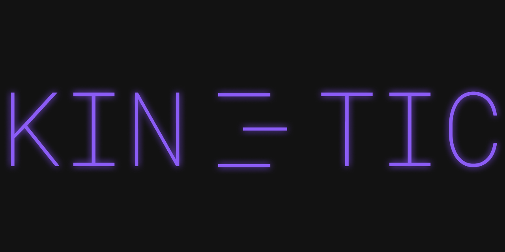

# Kinetic

Kinetic is a desktop app that takes a script you write and turns it into a video with animations and moving graphics. **Note: This project is in active development and this is the first iteration being updated to GitHub**.



**Try it out:** You can download the latest version for your computer on the releases page or run it locally following the guide below.

## Quick Start

You can start the app on your computer using these two commands:
```bash
npm install
npm run dev
```

## Features

* **AI generation**: You write a script or prompt and the AI sets up all the slides and movements.
* **Easy editing**: You can edit layouts, colors, and sizes using the sidebar controls on the screen.
* **Morph transitions**: A custom movement engine handles transitions so you don't have to write math or code.
* **Audio sync**: You can upload a song or a voice clip and the graphics bounce along with the sound.
* **MP4 rendering**: You can render the whole project into a real MP4 video file on your computer.


## How to Run It Locally

You need to install a couple of things first. Make sure you have Node.js version 18 or higher. You also need to install FFmpeg on your computer and make sure it's added to your environment path. It's necessary because the video exporter needs FFmpeg to stitch the video frames together.

Follow these steps:

1. Clone the repository to your computer:
```bash
git clone https://github.com/Cravex1862/kinetic.git
cd kinetic
```

2. Install all the packages:
```bash
npm install
```

3. Start the application:
```bash
npm run dev
```

4. Go to the settings page in the app and type in your Gemini API key so the AI generator can talk to the models.

## How It Works

I built this app using Electron, React, and Remotion. Most AI video tools make weird, blurry videos where the text is messed up and hard to read. I didn't do that. Instead, my app reads your prompt and builds a layout with actual React components.

Then, I use a morphing library that calculates the movement between visual states. This keeps the text sharp at any size. Remotion takes these React components and exports them frame by frame into an MP4 file. It takes some computing power, but the video looks perfect.

## Credits

* [Remotion](https://www.remotion.dev) for rendering React components into video files.
* [Electron](https://www.electronjs.org) for packaging React into a desktop application.
* [Phosphor Icons](https://phosphoricons.com) for the interface icons I used.


