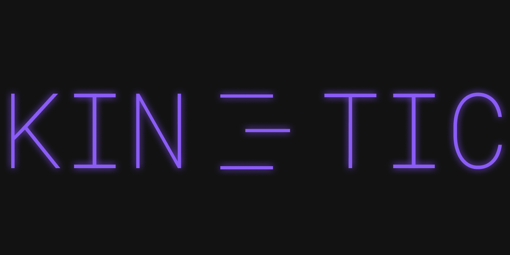

# Kinetic

Kinetic is a desktop app that makes motion graphics videos by writing React code and rendering it frame by frame. No generative video models. The text stays sharp because it is just React.

I built it because I wanted a way to make clean SaaS demos and logo animations without opening After Effects. It runs on Electron, the UI is React, and Remotion does the actual rendering. That combination is stubborn but it works.



## Quick start

You need Node 20 and npm.

```bash
# install
npm install

# run tests
npm test

# open the desktop app
npm run dev
```

`npm run build` creates the installers in `releases`. The GitHub workflow builds on tag push.

## How it works

Each video is a set of React components. Remotion asks React for frame 0, then frame 1, and so on, up to 30 frames per second. Because it is code, a 4K export still has crisp type.

Electron has two sides. The main process can read and write files. The renderer process cannot. Every file operation goes through `window.electronAPI`, which is exposed in `src/main/preload.ts` and handled in `src/main/index.ts`. The types for that bridge live in `src/shared/ipc-types.ts`.

```
Electron main  ->  handles files, runs Remotion render, talks to the OS
React studio   ->  timeline, sidebar, preview, asks main to do the heavy work
Remotion       ->  takes the TSX scenes and draws each frame
```

For music, the app can run a small BeatNet model in the browser with ONNX. It reads the soundtrack, makes a spectrogram, and gives each beat a strength score. Those scores become keyframe timings.

## What it can make

Kinetic has a few starter flows. Each one writes its own `VideoComposition.tsx`.

* SaaS demo. Give it a repo path or a GitHub URL. The scanner reads routes, components, colors and fonts, then the pipeline writes a product walkthrough.
* Basic animation. A sandbox for any short clip. You set the prompt, colors, fonts, and optional voiceover or music.
* Logo animation. SVG only. Pick a preset like 3D spin or particle burst, upload an SVG, and it builds a 5 second reveal. It can use flubber for true SVG morphs.
* Studio. After a video is generated you can preview it, scrub the timeline, and fix a single scene.

The scenes use a small primitive kit in `src/renderer/primitives`. That kit has things like `BrowserFrame`, `SidebarLayout`, `BarChartCard`, `Cursor`, and a few wrappers for entering and exiting. The generated scenes import only `react` and `remotion`, plus `flubber` and icons where needed.

## Tests

There is a tiny test suite with no extra test framework.

```bash
npm test
```

It checks three things:

* Beat detection calculates frame hops and normalizes loudness to a 10 to 100 scale.
* The parser removes duplicate keyframes so `f0 < f1 < f2` and the export does not crash.
* The helpers blend numbers and hex colors and build 3D transforms.

The tests live in `testing/`. They run with the Node test runner through `tsx`.

## Stack

Electron 30, React 18, TypeScript in strict mode, Tailwind with utility classes only, Remotion 4. Audio runs with `onnxruntime-web` and `@xenova/transformers`. Icons are Phosphor.

## Credits

I did not build this alone. These are the pieces Kinetic stands on, with links so you can check them yourself.

**Core**

* [Remotion](https://www.remotion.dev) — renders React components into video frames. Every scene is just React.
* [Electron](https://www.electronjs.org) — turns the web studio into a desktop app and handles files and exports.
* [React](https://react.dev) and [Tailwind CSS](https://tailwindcss.com) — UI, utility classes only.
* [TypeScript](https://www.typescriptlang.org) — strict mode everywhere.
* [Phosphor Icons](https://phosphoricons.com) — interface icons.
* [Flubber](https://github.com/veltman/flubber) — SVG path morphs for logo reveals. Already imported for generated scenes.
* [Vite](https://vitejs.dev) — dev server for the studio.
* [FFmpeg](https://ffmpeg.org) — used by Remotion to write the final MP4.

**Audio and local models**

* [ONNX Runtime Web](https://onnxruntime.ai) — runs models in the browser.
* [@xenova/transformers](https://huggingface.co/docs/transformers.js) — loads Whisper locally for voiceover transcription.
* [Whisper small](https://huggingface.co/Xenova/whisper-small) via `src/renderer/agents/whisperWorker.ts` — transcribes uploaded voiceover audio to timestamped script.
* [BeatNet ONNX](https://github.com/mir-aid/beatnet) — model file `public/models/beatnet.onnx` gives each beat an oomph score.
* [all-mpnet-base-v2](https://huggingface.co/Xenova/all-mpnet-base-v2) — embedding model in `public/models/Xenova/all-mpnet-base-v2/` that powers the skill RAG search.
* [Vader Sentiment](https://github.com/cjhutto/vaderSentiment) (`vader-sentiment`) — used in `src/renderer/utils/vaderSentiment.ts` for quick sentiment hints.

**Design specs and brand data**

* [Awesome Design.md](https://github.com/VoltAgent/awesome-design-md/tree/main) — 70+ brand design files in `src/renderer/design-specs/awesome-design-md/` (e.g. `design-md/apple/DESIGN.md`, `design-md/figma/DESIGN.md`). The design agent reads these for palette and type hints.
* [GitHub Primer Primitives](https://primer.style/primitives) — token set in `src/renderer/design-specs/github/primer-primitives/` (`src/tokens/functional/color`, `typography`, `spacing`). Used as a fallback seed palette.
* [Example composition](src/renderer/design-specs/exampleComposition.tsx) — a hand-written reference scene for layout.
* Local brand assets in `kinetic_brand/` — logo and type used in the studio shell.

**Skills**

All prompts and motion recipes come from [iart-ai/motion-skills](https://github.com/iart-ai/motion-skills), copied into `skills/` and indexed in `skills/skills-index.json`:

* [frontend-design](skills/frontend-design/SKILL.md) — how I tried to keep the UI from looking templated.
* [ad-video-skills](skills/ad-video-skills/skills/ad-creative-video/SKILL.md), [launch-video](skills/ad-video-skills/skills/launch-video/SKILL.md), [data-animation-skills](skills/data-animation-skills/skills/chart-animation/SKILL.md), [explainer-video-skills](skills/explainer-video-skills/skills/diagram-animation/SKILL.md), [ecommerce-video-skills](skills/ecommerce-video-skills/skills/product-demo-video/SKILL.md), [manim-skills](skills/manim-skills/skills/manim/SKILL.md), [map-animation-skills](skills/map-animation-skills/skills/map-animation/SKILL.md), [motion-design-skills](skills/motion-design-skills/skills/motion-art-direction/SKILL.md), [kinetic-typography-skills](skills/kinetic-typography-skills/skills/kinetic-typography/SKILL.md), [tiktok-video-skills](skills/tiktok-video-skills/skills/short-form-video/SKILL.md), [webgl-animation-skills](skills/webgl-animation-skills/skills/threejs-animation/SKILL.md), [youtube-video-skills](skills/youtube-video-skills/skills/youtube-intro-outro/SKILL.md) and the rest of the video, motion, and generative illustration packs. Each `SKILL.md` says when to use it and what variables the scene can rely on.

**Other bits I reused**

* [Model Context Protocol SDK](https://github.com/modelcontextprotocol/typescript-sdk) (`@modelcontextprotocol/sdk`) — experimental MCP server in `src/experimental/mcp/`.
* [Repomix](https://github.com/yamadashy/repomix) — packs a target repo into one XML file for the scanner (`packRepo` in `src/main/index.ts`).
* Local system fonts via `getSystemFonts` in `src/main/index.ts` and `queryLocalFonts` in the renderer.

I stitched these together and fixed the parts that broke at 2 a.m. If I missed a credit, open an issue and I will add it.
